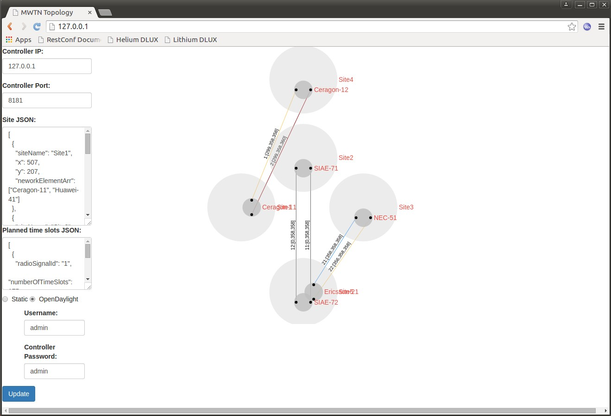

## MW Operational Topology application

### Overview:
This application displays the Microwave topology operational status in a graph view using Sigma.js.

### How it works:
#### The application code is devided into 2 parts:

1) MW Topology library - Provides APIs for managing Microwave data and retreiving operational information about the Microware network topology by using AJAX calls to OpenDaylight/static resources to retreive 

2) Topolgy GUI application - uses the toplogy library to retreive the network topology and display it in the GUI useing Sigma.js

####  modes to retrieve information about the topology:

1) Use static JSON files that represent the network elements

2) Use the OpenDaylight REST API to retrieve information about the topology

The application provides a simple configuration GUI(panel) to modify the controller IP/Port, site information, planned configuration and application mode.

Note: This is a client-side application only, thus the configuration is not persistent, in order to change the defaults, change the index.html configuration fields and refresh the browser.

### How to deploy:
1) Install a Nginx (other web servers can be used as well:
~~~~
sudo apt-get install nginx
~~~~
2) clone this repository

3) Copy the source files into the web server:
~~~~
cp -r <path/to/mwOperationalTopology>/* /usr/share/nginx/html/
~~~~
To overcome Access-Control-Allow-Origin policy for the static mode:
~~~
sudo gedit /etc/nginx/sites-available/default
~~~
Append the following into the location tag:
~~~
add_header Access-Control-Allow-Origin *;
~~~
And restart Nginx:
~~~
sudo service nginx restart
~~~

### How to use:
To access the GUI simply go to http://127.0.0.1 (Nginx server IP)

Modify the "Site JSON" section to contain the netowrk elements by specifing the uuid of the element in the networkElementArr, **note**: the number of elements per site is limited to 4.

Choose the "Static" option to retrieve the data from the files located at <path/to/application/>/network-elements
The big grey cirecles represent a site, the inner big grey circles represent network elements and the small black circles represent an AirInterface LP.

Edges represent a matching radioSignalId between 2 AirInterface nodes. The edge label format:

    <link-id>:[<effective-capacity>,<configured-capacity>,<planned-capacity>]

Capacities are specified in time slots format and are being transformed into Mbps. Effective and configured capacities are read from the elements, while planned capacity is taken from the "Planned time slots JSON" which is located at the configuration panel on the left of the screen.

color meaning:
~~~
Effective capacity = 0 -> Grey
Configured != Planned -> Red
Effective = Configured -> blue
Effective < Configured -> orange
~~~
